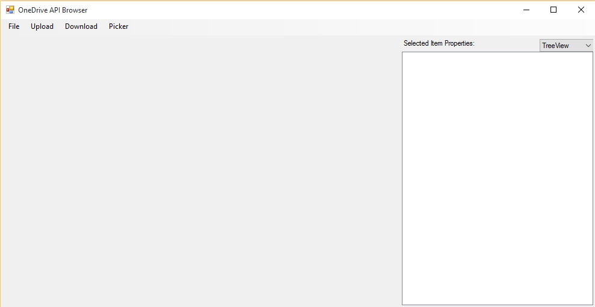
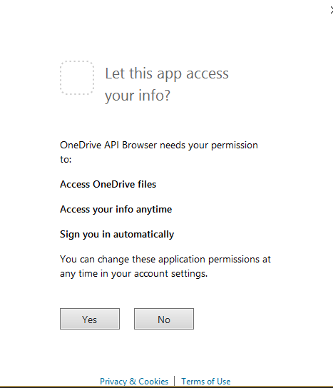

# OneDrive API Browser Sample

The OneDriveAPIBrowser sample is a [Windows Forms](https://msdn.microsoft.com/en-us/library/dd30h2yb(v=vs.110).aspx) app sample that uses the [OneDrive SDK for C#](https://github.com/OneDrive/onedrive-sdk-csharp). In this sample, users can browse files and folders that are stored on OneDrive, and view metadata.

## Set up

1. Install [Visual Studio](https://www.visualstudio.com/downloads/download-visual-studio-vs) and all available updates, if you don't already have it. 
2. Download the OneDriveAPIBrowser sample from [GitHub](https://github.com/OneDrive/onedrive-sdk-csharp) or create your own fork of the repository.
3. From Visual Studio, open the **OneDriveSdk.sln** solution.
4. Go to the OneDriveApiBrowser project in the solution and view the code for FormBrowser.cs.
5. Update your OneDrive for Business and/or OneDrive Consumer application details in the following variables at the top of the file:
```csharp
        private const string AadClientId = "Insert your AAD client ID here";
        private const string AadReturnUrl = "Insert your AAD return URL here";

        private const string MsaClientId = "Insert your MSA client ID here";
```

For more details on setting up an application to access OneDrive Consumer or OneDrive for Business please read the [registration documentation](https://dev.onedrive.com/app-registration.htm) for the API.

## Run the sample

In Visual Studio, select the sample OneDriveAPIBrowser from the Startup project list, and then press **F5** or click **Start** to run the sample. The sample looks like this: 



### Sign-in to OneDrive Consumer
When the OneDrive API Browser app opens, choose **File** | **Sign in to MSA** to sign in to a personal OneDrive account. Once you have signed in to your Microsoft account, a dialog will appear, asking for permissions to access OneDrive files.



Click **Yes**. 

### Sign-in to OneDrive for Business
When the OneDrive API Browser app opens, choose **File** | **Sign in to AAD** to sign in to a business OneDrive account. Once you have signed in to your Azure Active Directory account, a dialog will appear, asking for the permissions configured for the application ID in the Azure Active Directory portal.

Click **Yes**. 

### After sign-in

Your OneDrive items will appear on the left pane, with each item represented by a thumbnail. On the right pane, the selected item's properties are displayed. You can choose how the item properties are displayed, whether its JSON or Tree View.

To upload a file, choose **Upload** from the menu and then choose **Simple - Path-based** to upload by path, or **Simple - ID-based** to upload by item id.

To download a file, select a file, and then choose **Download** from the menu.

The **Picker** menu opens up the signed-in user's OneDrive from a web browser.

## API features

### Retrieving an authenticated client

This sample gets a OneDrive Consumer **IOneDriveClient** instance using **GetMicrosoftAccountClient**. It gets a OneDrive for Business **IOneDriveClient** instance using **BusinessClientExtensions.GetActiveDirectoryClient**. After retrieving a client instance the app calls **AuthenticateAsync** to sign the user in.

```csharp
private IOneDriveClient oneDriveClient { get; set; }
private static readonly string[] Scopes = { "onedrive.readwrite", "wl.offline_access", "wl.signin" };
...
private async Task SignIn(ClientType clientType) 
{ 
     if (this.oneDriveClient == null) 
     { 
         this.oneDriveClient = clientType == ClientType.Consumer
             ? OneDriveClient.GetMicrosoftAccountClient(
                 FormBrowser.MsaClientId,
                 FormBrowser.MsaReturnUrl,
                 FormBrowser.Scopes,
                 webAuthenticationUi: new FormsWebAuthenticationUi())
             : BusinessClientExtensions.GetActiveDirectoryClient(FormBrowser.AadClientId, FormBrowser.AadReturnUrl);
     } 

     try 
     { 
         if (!this.oneDriveClient.IsAuthenticated) 
         { 
             await this.oneDriveClient.AuthenticateAsync(); 
         } 
...
```

The OneDrive SDK also provides a **SignOutAsync** method to easily sign the user out:

```csharp
await this.oneDriveClient.SignOutAsync();
```

### Get item properties

This sample demonstrates how to get an item's properties, by calling the **GetAsync** method of the **OneDriveClient** object:

```csharp
folder = await this.oneDriveClient.Drive.Root.Request().Expand(expandValue).GetAsync();
```

### Simple item upload

This sample makes use of the OneDrive API's ability to upload items by path or by id. 
Here, you upload an item by path:

```csharp
// Specify the folder path of the item to upload.
string folderPath = targetFolder.ParentReference == null 
 ? "/drive/items/root:" 
 : targetFolder.ParentReference.Path + "/" + Uri.EscapeUriString(targetFolder.Name); 
var uploadPath = folderPath + "/" + Uri.EscapeUriString(System.IO.Path.GetFileName(filename)); 

// Use the OneDrive SDK to upload the item by path.
var uploadedItem = await 
   this.oneDriveClient.ItemWithPath(uploadPath).Content.Request().PutAsync<Item>(stream); 

```

This example shows how to upload an item by id:
```csharp
var uploadedItem = await 
  this.oneDriveClient.Drive.Items[targetFolder.Id].ItemWithPath(filename).Content.Request() 
    .PutAsync<Item>(stream); 
```

## More resources

You can continue to explore this sample and the rest of its features by using GitHub or Visual Studio. The OneDrive SDK for CSharp/.NET is documented [here](https://github.com/OneDrive/onedrive-sdk-csharp/blob/master/README.md). To view a Windows Universal app sample that uses the OneDrive SDK for CSharp/.NET, see [OneDrivePhotoBrowser](https://github.com/OneDrive/onedrive-sdk-csharp/tree/master/samples/OneDrivePhotoBrowser). Make sure to also check out the OneDrive API's official documentation at [dev.onedrive.com](https://dev.onedrive.com). 

## Copyright

Copyright (c) Microsoft. All rights reserved.
